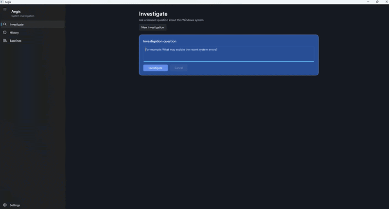
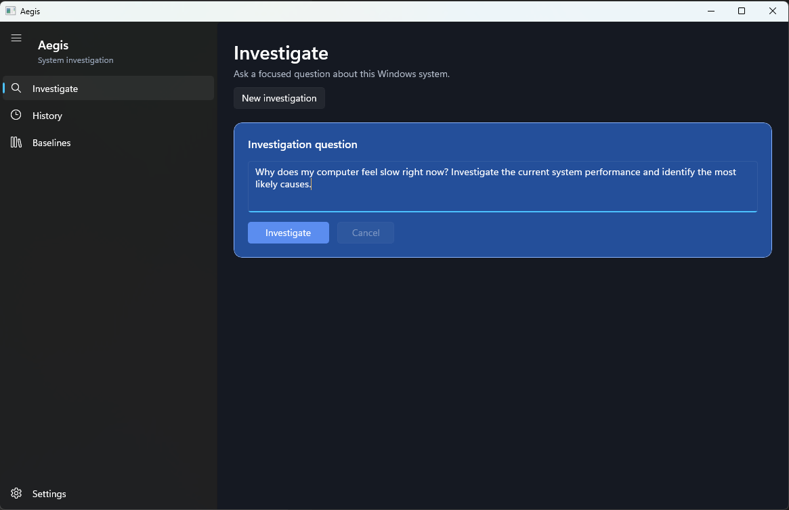
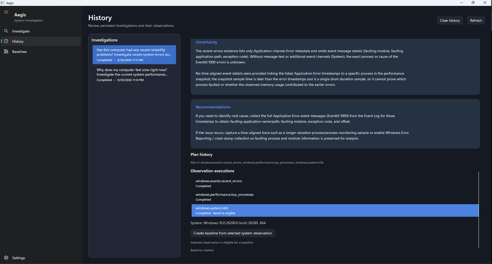

# Aegis

Aegis is a Windows-native AI systems analyst for bounded, read-only investigation of system behavior, reliability, and performance.

Its investigation loop is:

**Observe → Understand → Investigate → Correlate → Explain → Recommend → Report**

Aegis is an AI systems analyst, not a computer-control agent.

## Overview

Aegis combines a provider-neutral investigation runtime with a small set of explicitly registered Windows observation tools. It gathers bounded observations, sends structured evidence to the configured language model, and presents an evidence-grounded report with local history and baselines.

## Demo



## Current capabilities

Aegis currently provides these registered observation capabilities:

- `windows.system.info` — Windows platform, version, build, and system architecture.
- `windows.performance.system` — a bounded CPU-utilization and aggregate physical-memory snapshot.
- `windows.performance.top_processes` — bounded CPU and working-set rankings for accessible processes.
- `windows.events.recent_errors` — bounded Critical and Error metadata from the local System and Application event logs during the previous 48 hours. Event message text is not collected.

These tools do not provide general Windows access. Aegis does not inspect arbitrary files, execute shell or PowerShell commands, control processes, modify the registry, change security or services, control the firewall, or access credentials and sessions.

## Safety model

The model does not directly access Windows APIs or execute operating-system actions. The runtime enforces this boundary:

```text
Model
→ structured plan or decision
→ validated AgentRuntime
→ exact registered ToolId
→ reviewed read-only Windows observation
→ structured ObservationResult
→ model finalization
```

The runtime accepts only exact registered tools; unknown ToolIds fail safely. Observations execute sequentially. Each investigation has one initial planning phase, at most one bounded replan, and one shared observation budget. There is no arbitrary shell, PowerShell, or CMD execution, no file modification, no registry/security/service modification, no credential or session access, and no background autonomous monitoring.

## Architecture

Aegis is a Windows-native WinUI 3 application using the Windows App SDK and a provider-neutral `ILanguageModel` boundary. The OpenAI adapter is isolated from `Aegis.Core`. Persistence-neutral history and baseline contracts are implemented by the SQLite persistence layer.

## Requirements

- Windows x64
- .NET 10 SDK
- Visual Studio with MSBuild capable of building the current Windows App SDK project
- The required Windows SDK and Windows App SDK prerequisites for an unpackaged WinUI 3 application
- NuGet access for restore

Aegis is an unpackaged, x64 Windows App SDK application. No installer or packaged deployment release is currently included.

## Build and test

Run these commands from the repository root in a Visual Studio Developer PowerShell or another shell with MSBuild available:

```powershell
msbuild Aegis.sln /restore /t:Build /p:Configuration=Debug /p:Platform=x64
dotnet test tests\Aegis.Tests\Aegis.Tests.csproj --configuration Debug
```

## Running Aegis

After a successful x64 Debug build, the unpackaged executable is located at:

```text
src\Aegis\bin\x64\Debug\net10.0-windows10.0.26100.0\Aegis.exe
```

Configure the process environment before starting the application if live AI investigations are needed.

## OpenAI configuration

Aegis supports these process-scoped environment variables:

- `AEGIS_OPENAI_API_KEY` — required for live AI investigations.
- `AEGIS_OPENAI_MODEL` — optional model identifier; defaults to `gpt-5-mini` when unset.

PowerShell example using a placeholder value:

```powershell
$env:AEGIS_OPENAI_API_KEY = "<your-api-key>"
$env:AEGIS_OPENAI_MODEL = "gpt-5-mini"
```

Supply credentials through the process environment. Do not commit them to the repository. Aegis does not store or display API-key values.

## Data and privacy

Aegis stores investigation lifecycle and history data, observations and evidence, reports, and baselines locally in SQLite. The current database location is:

```text
%LOCALAPPDATA%\Aegis\aegis.db
```

Investigation prompts and the evidence needed for model reasoning are sent to the configured OpenAI provider. Review the provider’s applicable policies before using Aegis with sensitive questions or system data. Aegis does not persist API keys.

Application diagnostics currently use debug output rather than a durable diagnostic log. Diagnostic fields are bounded and do not include prompts, observation payloads, provider response bodies, credentials, or database paths.

## Screenshots





## Investigation behavior

Investigations use one initial plan and at most one replan, with a shared bounded observation budget and sequential execution. Cancellation is cooperative and propagates through the investigation and observation layers. Completed investigations, terminal outcomes, local history, and saved baselines are available in the application; Aegis does not continuously monitor the system in the background.

## Validation

The repository includes deterministic tests for planning, runtime validation, provider parsing and classification, observations, persistence, history, baselines, cancellation, and presentation behavior.

The current release-hardening baseline is:

- 203 tests passing
- x64 Debug Visual Studio MSBuild succeeding
- `git diff --check` passing

The package vulnerability audit currently reports no vulnerable packages from the available sources, but NU1900 indicates that vulnerability data retrieval was incomplete.

## Limitations

- Windows-native, x64 application.
- Uses explicitly registered, read-only observation tools.
- AI-generated analysis may include uncertainty and should be interpreted alongside the evidence shown.
- Designed for investigation and explanation, not arbitrary operating-system control.
- Operates on demand; it does not run autonomous background monitoring.
- Distributed as a source-build project rather than an installer/package.
- Building and running requires the Windows/.NET prerequisites listed above.

Copyright © 2026 Ali Akcin.
This project is published for portfolio purposes only.
Unauthorized copying, redistribution, or commercial use of this codebase is prohibited without prior written consent.
